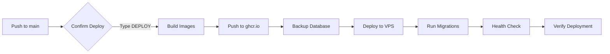

# DevOps Deployment Guide

Complete guide for deploying `sistema-reservas` to your VPS using Docker and GitHub Actions.

---

## 📋 Prerequisites

### VPS Requirements

- **OS**: Ubuntu 20.04+ or Debian 11+
- **RAM**: Minimum 2GB (4GB recommended)
- **CPU**: 2 cores minimum
- **Disk**: 20GB minimum
- **Docker**: Version 20.10+
- **Docker Compose**: Version 2.0+

### Domain Setup

Point your domains to your VPS IP:

```
sistema-reservas.com      → A record → YOUR_VPS_IP
api.sistema-reservas.com  → A record → YOUR_VPS_IP
*.sistema-reservas.com    → A record → YOUR_VPS_IP (wildcard, optional)
```

---

## 🚀 Quick Start

### 1. Install Docker on VPS

```bash
# SSH into your VPS
ssh root@your-vps-ip

# Install Docker
curl -fsSL https://get.docker.com -o get-docker.sh
sh get-docker.sh

# Install Docker Compose
docker-compose --version

# Add user to docker group (if not root)
usermod -aG docker $USER
```

### 2. Set Up GitHub Secrets

Follow the guide in [.github/SECRETS.md](.github/SECRETS.md) to configure all required secrets.

**Minimum required secrets:**

- `VPS_HOST`, `VPS_USERNAME`, `VPS_SSH_KEY`
- `PRODUCTION_DOMAIN`, `PRODUCTION_API_DOMAIN`
- `PROD_DB_USER`, `PROD_DB_PASSWORD`, `PROD_DB_NAME`
- `PROD_JWT_SECRET`, `PROD_JWT_REFRESH_SECRET`

### 3. Initial Deployment

```bash
# Push to main branch
git add .
git commit -m "Initial DevOps setup"
git push origin main
```

This triggers the **CD - Deploy to Production** workflow.

### 4. Monitor Deployment

1. Go to **Actions** tab on GitHub
2. Select **CD - Deploy to Production**
3. Click on the running workflow
4. Watch the logs

---

## 🏗️ Architecture

```
┌─────────────────────────────────────────────────────┐
│                    YOUR VPS                         │
│                                                     │
│  ┌─────────────┐                                    │
│  │   Traefik   │ :80, :443                         │
│  │  (Proxy)    │ SSL Termination                   │
│  └──────┬──────┘                                    │
│         │                                           │
│    ┌────┴────┐          ┌─────────────┐            │
│    │         │          │   Backend   │            │
│    │         └─────────►│  (Express)  │            │
│    │         :3000      │   :3001     │            │
│    │                    └──────┬──────┘            │
│    │                           │                   │
│    │                    ┌──────┴──────┐            │
│    │                    │  PostgreSQL │            │
│    │                    │   :5432     │            │
│    │                    └─────────────┘            │
│    │                           │                   │
│    │                    ┌──────┴──────┐            │
│    └───────────────────►│    Redis    │            │
│           :3001         │   :6379     │            │
│                         └─────────────┘            │
└─────────────────────────────────────────────────────┘
```

---

## 📦 Docker Compose Services

| Service    | Container Name              | Port    | Description         |
| ---------- | --------------------------- | ------- | ------------------- |
| `postgres` | `sistema-reservas-db`       | 5432    | PostgreSQL database |
| `redis`    | `sistema-reservas-redis`    | 6379    | Redis cache         |
| `backend`  | `sistema-reservas-backend`  | 3001    | Express API server  |
| `frontend` | `sistema-reservas-frontend` | 3000    | Next.js app         |
| `traefik`  | `sistema-reservas-proxy`    | 80, 443 | Reverse proxy + SSL |

---

## 🔧 Manual Deployment (Alternative)

If you prefer manual deployment:

### 1. Clone Repository on VPS

```bash
cd /opt
git clone https://github.com/williamgarciadev/sistema-reservas.git
cd sistema-reservas
```

### 2. Create Environment File

```bash
cp .env.production .env
nano .env  # Edit with your values
```

### 3. Build and Run

```bash
# Build images
docker-compose build

# Run migrations
docker-compose run backend npx prisma migrate deploy

# Start all services
docker-compose up -d
```

### 4. Check Status

```bash
# View running containers
docker-compose ps

# View logs
docker-compose logs -f

# Check backend health
curl http://localhost:3001/health

# Check frontend
curl http://localhost:3000
```

---

## 🔄 CI/CD Workflows

### Workflow Overview

| Workflow                 | Trigger                      | Purpose                    |
| ------------------------ | ---------------------------- | -------------------------- |
| `ci.yml`                 | Push to `main`/`develop`, PR | Lint, test, build          |
| `cd-staging.yml`         | Push to `develop`            | Auto-deploy staging        |
| `cd-production.yml`      | Push to `main`               | Manual approval production |
| `container-registry.yml` | Git tags (`v*`)              | Build & push images        |

### Deployment Process

#### Staging (Automatic)


#### Production (Manual Approval)



---

## 🔐 SSL/TLS Certificates

Traefik automatically obtains and renews SSL certificates from Let's Encrypt.

**Certificate storage:** `/var/lib/traefik/letsencrypt/acme.json` (inside container)

**To renew manually:**

```bash
docker-compose restart traefik
```

---

## 📊 Monitoring

### Check Service Health

```bash
# All containers
docker-compose ps

# Backend logs
docker logs sistema-reservas-backend -f

# Frontend logs
docker logs sistema-reservas-frontend -f

# Database logs
docker logs sistema-reservas-db -f
```

### Database Backup

```bash
# Manual backup
docker exec sistema-reservas-db pg_dump -U postgres sistema_reservas_prod > backup.sql

# Restore from backup
cat backup.sql | docker exec -i sistema-reservas-db psql -U postgres sistema_reservas_prod
```

### Automated Backups (Recommended)

Add to crontab:

```bash
# Daily backup at 3 AM
0 3 * * * docker exec sistema-reservas-db pg_dump -U postgres sistema_reservas_prod > /backups/backup-$(date +\%Y\%m\%d).sql
```

---

## 🚨 Troubleshooting

### Container Won't Start

```bash
# Check logs
docker logs <container-name>

# Check resource usage
docker stats

# Restart container
docker-compose restart <service-name>
```

### Database Connection Failed

```bash
# Check if postgres is running
docker-compose ps postgres

# Test connection
docker exec -it sistema-reservas-db psql -U postgres -d sistema_reservas_prod

# Check backend can reach database
docker exec -it sistema-reservas-backend ping postgres
```

### SSL Certificate Issues

```bash
# Check Traefik logs
docker logs sistema-reservas-proxy

# Force certificate renewal
docker-compose rm traefik
docker-compose up -d traefik
```

### Deployment Fails

1. Check GitHub Actions logs
2. Verify all secrets are set correctly
3. SSH into VPS and check container status
4. Review `.env` file for typos

---

## 📈 Scaling

### Horizontal Scaling

```yaml
# In docker-compose.yml, add replicas
deploy:
  replicas: 3
  resources:
    limits:
      cpus: "0.5"
      memory: 512M
```

### Vertical Scaling

Increase VPS resources:

- **RAM**: 4GB → 8GB → 16GB
- **CPU**: 2 → 4 → 8 cores
- **Disk**: Add separate volume for database

### Database Optimization

```bash
# Add indexes (via Prisma migrations)
# See prisma/schema.prisma for existing indexes

# Vacuum database
docker exec sistema-reservas-db psql -U postgres -c "VACUUM ANALYZE;"
```

---

## 💰 Cost Estimate

| Resource             | Provider            | Cost/Month        |
| -------------------- | ------------------- | ----------------- |
| VPS (4GB RAM, 2 CPU) | DigitalOcean/Linode | $24               |
| Domain               | Namecheap           | $10/year          |
| Email (Resend)       | Resend              | Free → $20        |
| Payments (Stripe)    | Stripe              | 2.9% + $0.30      |
| **Total**            |                     | **~$24-44/month** |

---

## 🎯 Next Steps

1. ✅ Set up GitHub secrets
2. ✅ Configure DNS records
3. ✅ Install Docker on VPS
4. ✅ Deploy to staging
5. ✅ Test all workflows
6. ✅ Deploy to production
7. ✅ Set up monitoring (Sentry)
8. ✅ Configure automated backups

---

**Need help?** Open an issue or check:

- [GitHub Actions Docs](https://docs.github.com/en/actions)
- [Docker Docs](https://docs.docker.com/)
- [Traefik Docs](https://doc.traefik.io/traefik/)
